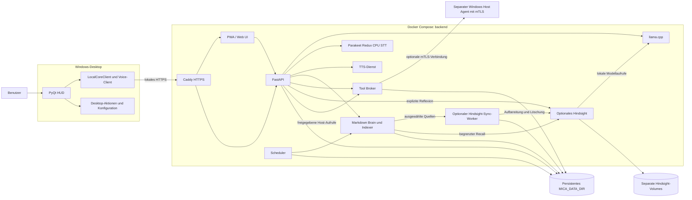

# MICA V2 – Architektur

Stand: 2026-10-04. MICA hat zwei getrennte Laufzeitbereiche. Die Desktop-App
ist ein Windows-Client. Der Docker-Compose-Stack im Verzeichnis `backend/`
stellt API und lokale Dienste bereit. Der native Windows Host Agent ist ein
separater, optionaler Prozess und gehört nicht zu den Modellcontainern.

## Überblick



Der öffentliche Caddy-Einstieg verlangt einen HTTPS-Browser-Login oder den
nativen API-Token. Die API prüft den Token selbst vor HTTP-Handlern und
WebSocket-Verbindungsaufbau; Loopback-Binding allein autorisiert keinen Zugriff.
Aktionsfreigaben und signierte Provider-Webhooks haben zusätzliche eigene
Guards. Einrichtung und genaue Ausnahmen stehen in [API-Zugang](api-access.md).

## Desktop

`desktop/local_main.py` startet die Generation-2 PyQt-Oberfläche. Sie nutzt
`desktop/core/local_core_client.py` für API-Aufrufe und
`desktop/core/local_voice.py` für Mikrofon-/Audio-Transport und Wake-Word.
Der Standardendpunkt ist `https://mica.local`; `MICA_CORE_URL` kann ihn auf
einen anderen lokalen HTTPS-Endpunkt setzen. Ein selbstsigniertes oder
internes Zertifikat muss über die konfigurierte CA-Datei vertrauenswürdig
gemacht werden. Die Desktop-App wird vom Root-Skript
`install_and_start.ps1` vorbereitet und gestartet; dieses Skript startet den
Backend-Compose-Stack nicht.

`Start MICA.cmd` verwendet dagegen `python -m desktop.start_mica` mit dem
Python aus PATH. Dieser gemeinsame lokale Starter startet bei Bedarf Docker
Desktop, ergänzt fehlende lokale Zugangsdaten in Credential Manager, startet
Compose und einen bereits konfigurierten Windows-Host-Agent. Erst nach der
HTTPS-Gesundheitsprüfung öffnet er die UI. Er übernimmt bestehende Modelle und
die konfigurierte Aktions-Allowlist. Abhängigkeiten werden weiterhin über
`install_and_start.ps1` eingerichtet; der gemeinsame Starter installiert sie
nicht selbst.

Die Desktop-Module unter `desktop/core/` sind eigenständige Client- und
UI-Funktionen. Sie werden nicht direkt von `backend/services/` importiert.
Insbesondere ist der lokale UI-Start allein kein Beleg für einen gesunden
Backend-Endpunkt.

Die UI teilt Konfiguration und Kontext (`desktop/ui_support.py`), Theme
(`desktop/ui_theme.py`), Canvas/Eingaben/Medien (`desktop/ui_widgets.py`),
Einrichtung/Anpassung (`desktop/ui_appearance.py`), Einstellungen
(`desktop/ui_settings.py`), Zusatzpanels (`desktop/ui_panels.py`) und die lokalen
Verlauf-/Erinnerungs-/Gedächtnisseiten (`desktop/ui_pages.py`). `ui.py`
stellt weiterhin das Hauptfenster und den bestehenden Client-Einstieg bereit.
Schalter nutzen eine gemeinsame Theme-Funktion; ein ungenutzter Systemmetrik-
Thread wird beim Import nicht mehr gestartet.
Dekorative HUD- und Wellenform-Timer laufen nur bei sichtbaren Widgets. Lokale
Seiten teilen die Kopfzeilen-Erstellung, ohne ihre bisherigen MainWindow-
Methoden oder Bedienwege zu ändern.

Der native Windows-Host-Agent ist eine eigene Ausführungsgrenze: Sein Runner
nutzt ausdrücklich `desktop/core/action_adapters.py`. Das ist keine Abhängigkeit
der Backend-API-Dienste von der UI. Die Host-Historie importiert keine Adapter;
gemeinsame Dateipfad-Semantik liegt in `mica_shared/file_paths.py`, ohne Imports
aus einer der Laufzeiten.

Capability-Manifeste und Sprachadressierung liegen ebenfalls in `mica_shared/`.
Beide Laufzeiten importieren dieselben Klassen. Die Backend-Kompatibilitätsmodule
exportieren diese Klassen nur weiter; der Desktop verwendet keinen Doppel-Import
mit einem alternativen Suchpfad. Aktive Python-Imports beginnen mit `desktop.*`,
`backend.*` oder `mica_shared.*`.

Der frühere Gemini-Live-Einstieg, gebündelte Plugins, das alte Phone-Dashboard
und zehn ungenutzte Core-Module liegen unter `legacy/gemini_live/`. Normale
Tests und Python-Dienst-Images schließen dieses Archiv aus. Aktive native
Aktions- und Feature-Abhängigkeiten bleiben unter `desktop/`; der Advanced-Agent
lädt beim Initialisieren keine archivierten Plugins. Details und historische
Testquellen stehen in [Legacy-Archiv](../legacy/README.md).

## Backend und Dienste

`backend/services/api/app.py` ist der schlanke Zusammensetzungspunkt. Die
Factory `create_app(data_dir=None, dependencies=None)` erzeugt pro App eine
eigene `ApiRuntime` mit Stores, Freigabesitzungen und Voice-Sessions. Importieren
allein erzeugt keine Datenbanken. `data_dir` ist insbesondere für isolierte
Tests gedacht; ohne diesen Parameter gelten die dokumentierten Umgebungswerte.
Tests können Abhängigkeiten wie Completion-Funktionen oder den HTTP-Transport
gezielt je Instanz ersetzen, ohne das API-Modul neu zu laden.

Request-Schemas liegen in `api/schemas.py`, gemeinsame Feature-Guards in
`api/gates.py`. Fachmodule unter `api/routers/` enthalten Conversation,
Memory, Learning, Tasks, Schedules, Planning, Improvements, Voice, Perception,
Connectors, Approvals, Emergency, Health und Maintenance. Der gemeinsame
Router-Binder bindet die Methoden an die jeweilige App-Instanz. Compose startet
`uvicorn backend.services.api.app:create_app --factory`; der alte Modul-Singleton
`services.api.app:app` ist kein Einstiegspunkt mehr.

Python-Dienst-Images bauen aus dem Repository-Root und kopieren ausschließlich
`backend/services`, das Backup-Modul, Web-UI und `mica_shared`. Die Root-
`.dockerignore` schließt andere Inhalte standardmäßig aus, insbesondere lokale
Konfiguration, virtuelle Umgebungen und Legacy-Code. STT und TTS behalten ihre
eigenen Build-Kontexte und Einzeldatei-Einstiege.

`backend/docker-compose.yml` beschreibt API, llama.cpp, Whisper-STT,
TTS, Brain-Indexer, Tool Broker, Scheduler, Web UI und Caddy. Der optionale
`fallback`-Compose-Profil ergänzt einen zweiten lokalen LLM-Server. Abhängigkeiten
werden über Healthchecks bzw. frische Worker-Abschlussmarker geprüft, bevor die
API als betriebsbereit gilt.

Die API und gemeinsamen Regeln liegen in `backend/services/`. Der Brain hält
Markdown als maßgebliche Daten; SQLite FTS- und lokale Vektorindizes lassen sich
aus den Markdown-Dateien wiederherstellen. Die regulären Backend-Daten liegen
unter dem gemounteten `MICA_DATA_DIR` (im Container `/data`). Desktop-Zustand
unter `.mica-data/` ist davon getrennt.

`backend/services/common/brain_index.py` synchronisiert geänderte Markdown-
Quellen transaktional mit FTS, Vektoren, Lernfeld und Trefferreihenfolge.
Gespeicherte Inhaltsfingerprints erkennen auch externe Änderungen mit gleichem
Zeitstempel und gleicher Dateigröße. Suchen lesen die Quellen einmal; unveränderte
Dokumente werden nicht erneut gechunkt oder eingebettet. Explizites `reindex()`
rekonstruiert weiterhin den vollständigen Index; der periodische Index-Worker
nutzt `force=False`. Markdown-Schreibvorgänge veröffentlichen vollständige Dateien
atomar. Details und reproduzierbare Messungen stehen im
[Refactoring-Nachweis](code-efficiency.md).

Die Windows-Bereitstellung startet Compose über
`python -m backend.windows_launcher`. Zugangsdaten werden aus Windows
Credential Manager anhand einer kleinen Allowlist gelesen und nur an den
Compose-Prozess weitergereicht. Auf Linux werden die Deploymentwerte über
`backend/.env` konfiguriert. Geheimnisse gehören nicht in versionierte Dateien.

### Optionales Hindsight-Gedächtnis

`backend/docker-compose.hindsight.yml` ergänzt den Stack um Hindsight 0.10.2
und einen eigenen Sync-Worker im Profil `hindsight`. Beide Freigaben
`MICA_HINDSIGHT_ENABLED=1` und `MICA_HINDSIGHT_ALLOW_PRIVATE=1` sind erforderlich;
die Beispielkonfiguration lässt sie ausgeschaltet. Hindsight nutzt den lokalen
llama.cpp-Server sowie lokal heruntergeladene Embedding-/Reranker-Modelle.
Die mitgelieferte Konfiguration veröffentlicht keine Hindsight-Ports am Host.

Der Worker überträgt nur ausgewählte kurze Quellen und verwaltet bestätigte
Versionen, Löschungen und Wiederholungen in einem SQLite-Ledger unter
`/data/memory-sync/hindsight.sqlite3`. Recall akzeptiert ausschließlich aktuell
bestätigte Quellen; der Antwortkontext stammt aus deren aktuellem Markdown.
Exakte lokale Treffer haben Vorrang. Bei einem Dienst-Ausfall bleibt die lokale
Suche verfügbar. Reflexion wird ausdrücklich angefordert, mit Quellen als
Ableitung gekennzeichnet und nicht zurück in den Brain geschrieben.

Die Hindsight-Datenbank und der Modellcache liegen in separaten Docker-Volumes.
Der bestehende Backup-Drill sichert das Sync-Ledger am Standardpfad als JSON;
die Hindsight-Volumes benötigen eine eigene Sicherung. Details, API-Endpunkte
und die Grenzen des lokalen CPU-Piloten stehen in [hindsight.md](hindsight.md).

## Aktionspfad und Sicherheitsgrenzen

```text
UI oder PWA → API/Orchestrator → Policy und Freigabe → Tool Broker
                                                   → optionaler Host Agent
```

- Der API-Orchestrator plant und beantwortet Anfragen; der Broker validiert
  Actions erneut anhand der Capability- und Policy-Regeln.
- Destruktive oder externe Aktionen benötigen eine passende, begrenzte
  Benutzerfreigabe. Der Broker führt keine vom Modell gelieferten Shelltexte
  aus.
- Der Not-Aus blockiert neue Policy-Entscheidungen und widerruft ausstehende
  Freigaben bzw. Aufgaben.
- Modellcontainer und Broker erhalten keinen Docker-Socket. Native Host-Aktionen
  laufen nur über den separat konfigurierten mTLS-Host-Agent.
- Cloud-LLMs, Cloud-Sprachdienste und externe Connectoren sind opt-in. Die
  Übertragung privater Brain-/Profilinformationen benötigt eine zusätzliche
  explizite Konfiguration.
- Recherche, Automatisierung, Phase 4, Dream-RSI und andere optionale
  Funktionen besitzen getrennte Feature-Flags; Beispielkonfigurationen lassen
  sie standardmäßig aus.

## LLM, STT und TTS

Der Backend-LLM-Standard ist lokal und wird über llama.cpp bereitgestellt.
Cloud-Provider können separat ausgewählt werden. STT läuft über den lokalen
Whisper-Dienst. `MICA_TTS_ENGINE=auto` wählt die passende Sprachfamilie zum
LLM-Provider: lokale Provider verwenden lokale TTS; ein ausdrücklich
ausgewählter Gemini- oder OpenAI-Cloud-Provider nutzt dessen TTS. Es gibt
keinen stillen Providerwechsel, wenn das ausgewählte Modell oder der Schlüssel
fehlt.

Optionale Komponenten wie Laya haben eigene Aktivierung und Abhängigkeiten.
Laya beeinflusst nur semantische Bewertungen und kann deterministische
Freigaben, Capability-Regeln oder Ausführung nicht verändern; Details stehen
in [dream-rsi.md](dream-rsi.md).

## Konfiguration und Abnahme

- Root `.env.example`: Desktop- und optionale MICA-Feature-Flags.
- `backend/.env.example`: Compose-Zielhost, Pfade, Modelle und Backend-Betrieb.
- `MICA_DATA_DIR`: persistente Daten, Brain, Audit und lokale Datenbanken der
  Container.
- `MICA_CORE_URL` / `MICA_CORE_CA_FILE`: HTTPS-Verbindung des Desktop-Clients.

Docker-Konfiguration, Dienst-Health, Mikrofon, GPU, Backup, produktives LAN-
TLS/mTLS und externe Provider sind unterschiedliche Abnahmegegenstände.
Implementierte Funktionen und Tests allein beweisen keine Zielhost-Bereitschaft.
Die Prüfschritte stehen im [Backend-Leitfaden](../backend/README.md) und im
[Dokumentationsindex](README.md#phasen-und-abnahme).
