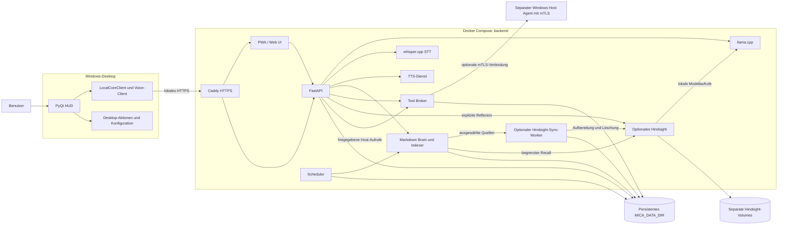

# MICA V2 – Architektur

Stand: 2026-09-30. MICA hat zwei getrennte Laufzeitbereiche. Die Desktop-App
ist ein Windows-Client. Der Docker-Compose-Stack im Verzeichnis `backend/`
stellt API und lokale Dienste bereit. Der native Windows Host Agent ist ein
separater, optionaler Prozess und gehört nicht zu den Modellcontainern.

## Überblick



## Desktop

`desktop/local_main.py` startet die Generation-2 PyQt-Oberfläche. Sie nutzt
`desktop/core/local_core_client.py` für API-Aufrufe und
`desktop/core/local_voice.py` für Mikrofon-/Audio-Transport und Wake-Word.
Der Standardendpunkt ist `https://mica.local`; `MICA_CORE_URL` kann ihn auf
einen anderen lokalen HTTPS-Endpunkt setzen. Ein selbstsigniertes oder
internes Zertifikat muss über die konfigurierte CA-Datei vertrauenswürdig
gemacht werden. Die Desktop-App wird vom Root-Skript
`install_and_start.ps1` vorbereitet und gestartet; dieses Skript startet den
Backend-Compose-Stack nicht.

Die Desktop-Module unter `desktop/core/` sind eigenständige Client- und
UI-Funktionen. Sie werden nicht direkt von `backend/services/` importiert.
Insbesondere ist der lokale UI-Start allein kein Beleg für einen gesunden
Backend-Endpunkt.

## Backend und Dienste

`backend/docker-compose.yml` beschreibt API, llama.cpp, Whisper-STT,
TTS, Brain-Indexer, Tool Broker, Scheduler, Web UI und Caddy. Der optionale
`fallback`-Compose-Profil ergänzt einen zweiten lokalen LLM-Server. Abhängigkeiten
werden über Healthchecks bzw. frische Worker-Abschlussmarker geprüft, bevor die
API als betriebsbereit gilt.

Die API und gemeinsamen Regeln liegen in `backend/services/`. Der Brain hält
Markdown als maßgebliche Daten; SQLite FTS- und lokale Vektorindizes lassen sich
aus den Markdown-Dateien wiederherstellen. Die regulären Backend-Daten liegen
unter dem gemounteten `MICA_DATA_DIR` (im Container `/data`). Desktop-Zustand
unter `.mica-data/` ist davon getrennt.

Die Windows-Bereitstellung startet Compose über
`python -m backend.windows_launcher`. Zugangsdaten werden aus Windows
Credential Manager anhand einer kleinen Allowlist gelesen und nur an den
Compose-Prozess weitergereicht. Auf Linux werden die Deploymentwerte über
`backend/.env` konfiguriert. Geheimnisse gehören nicht in versionierte Dateien.

### Optionales Hindsight-Gedächtnis

`backend/docker-compose.hindsight.yml` ergänzt den Stack um Hindsight 0.10.2
und einen eigenen Sync-Worker im Profil `hindsight`. Beide Freigaben
`MICA_HINDSIGHT_ENABLED=1` und `MICA_HINDSIGHT_ALLOW_PRIVATE=1` sind erforderlich;
die Beispielkonfiguration lässt sie ausgeschaltet. Hindsight nutzt den lokalen
llama.cpp-Server sowie lokal heruntergeladene Embedding-/Reranker-Modelle.
Die mitgelieferte Konfiguration veröffentlicht keine Hindsight-Ports am Host.

Der Worker überträgt nur ausgewählte kurze Quellen und verwaltet bestätigte
Versionen, Löschungen und Wiederholungen in einem SQLite-Ledger unter
`/data/memory-sync/hindsight.sqlite3`. Recall akzeptiert ausschließlich aktuell
bestätigte Quellen; der Antwortkontext stammt aus deren aktuellem Markdown.
Exakte lokale Treffer haben Vorrang. Bei einem Dienst-Ausfall bleibt die lokale
Suche verfügbar. Reflexion wird ausdrücklich angefordert, mit Quellen als
Ableitung gekennzeichnet und nicht zurück in den Brain geschrieben.

Die Hindsight-Datenbank und der Modellcache liegen in separaten Docker-Volumes.
Der bestehende Backup-Drill sichert das Sync-Ledger am Standardpfad als JSON;
die Hindsight-Volumes benötigen eine eigene Sicherung. Details, API-Endpunkte
und die Grenzen des lokalen CPU-Piloten stehen in [hindsight.md](hindsight.md).

## Aktionspfad und Sicherheitsgrenzen

```text
UI oder PWA → API/Orchestrator → Policy und Freigabe → Tool Broker
                                                   → optionaler Host Agent
```

- Der API-Orchestrator plant und beantwortet Anfragen; der Broker validiert
  Actions erneut anhand der Capability- und Policy-Regeln.
- Destruktive oder externe Aktionen benötigen eine passende, begrenzte
  Benutzerfreigabe. Der Broker führt keine vom Modell gelieferten Shelltexte
  aus.
- Der Not-Aus blockiert neue Policy-Entscheidungen und widerruft ausstehende
  Freigaben bzw. Aufgaben.
- Modellcontainer und Broker erhalten keinen Docker-Socket. Native Host-Aktionen
  laufen nur über den separat konfigurierten mTLS-Host-Agent.
- Cloud-LLMs, Cloud-Sprachdienste und externe Connectoren sind opt-in. Die
  Übertragung privater Brain-/Profilinformationen benötigt eine zusätzliche
  explizite Konfiguration.
- Recherche, Automatisierung, Phase 4, Dream-RSI und andere optionale
  Funktionen besitzen getrennte Feature-Flags; Beispielkonfigurationen lassen
  sie standardmäßig aus.

## LLM, STT und TTS

Der Backend-LLM-Standard ist lokal und wird über llama.cpp bereitgestellt.
Cloud-Provider können separat ausgewählt werden. STT läuft über den lokalen
Whisper-Dienst. `MICA_TTS_ENGINE=auto` wählt die passende Sprachfamilie zum
LLM-Provider: lokale Provider verwenden lokale TTS; ein ausdrücklich
ausgewählter Gemini- oder OpenAI-Cloud-Provider nutzt dessen TTS. Es gibt
keinen stillen Providerwechsel, wenn das ausgewählte Modell oder der Schlüssel
fehlt.

Optionale Komponenten wie Laya haben eigene Aktivierung und Abhängigkeiten.
Laya beeinflusst nur semantische Bewertungen und kann deterministische
Freigaben, Capability-Regeln oder Ausführung nicht verändern; Details stehen
in [dream-rsi.md](dream-rsi.md).

## Konfiguration und Abnahme

- Root `.env.example`: Desktop- und optionale MICA-Feature-Flags.
- `backend/.env.example`: Compose-Zielhost, Pfade, Modelle und Backend-Betrieb.
- `MICA_DATA_DIR`: persistente Daten, Brain, Audit und lokale Datenbanken der
  Container.
- `MICA_CORE_URL` / `MICA_CORE_CA_FILE`: HTTPS-Verbindung des Desktop-Clients.

Docker-Konfiguration, Dienst-Health, Mikrofon, GPU, Backup, produktives LAN-
TLS/mTLS und externe Provider sind unterschiedliche Abnahmegegenstände.
Implementierte Funktionen und Tests allein beweisen keine Zielhost-Bereitschaft.
Die Prüfschritte stehen im [Backend-Leitfaden](../backend/README.md) und im
[Dokumentationsindex](README.md#phasen-und-abnahme).
